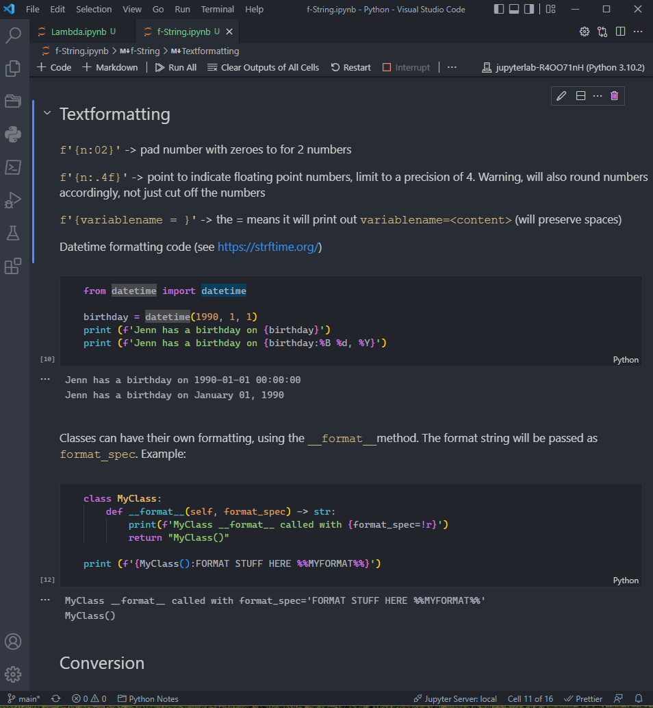
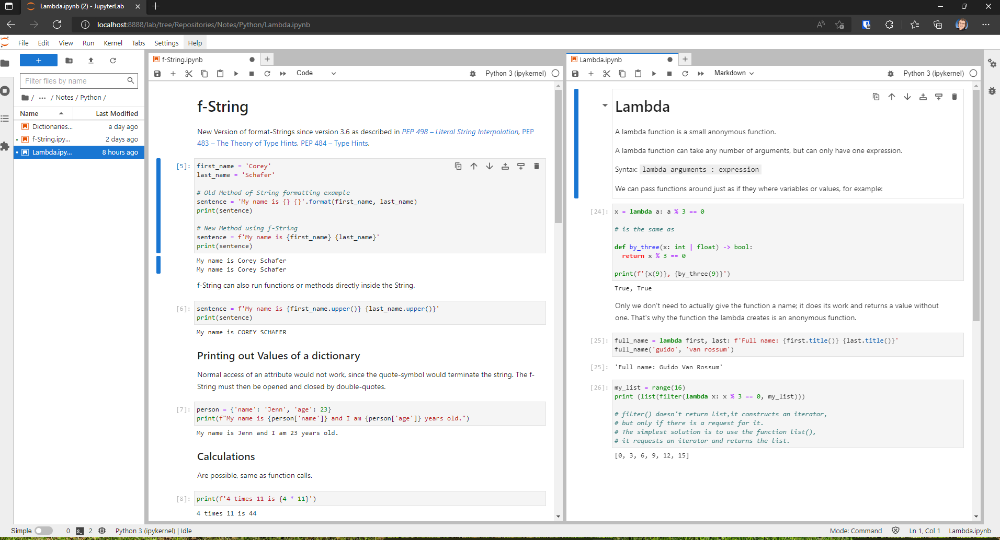

# Jupyter

[Jupyter Notebooks](https://jupyter.org/) are basically a combination of a [Markdown](https://www.markdownguide.org/getting-started/) parser to generate _rich Text Format_ (see [Markdown Cheat Sheet](https://github.com/adam-p/markdown-here/wiki/Markdown-Cheatsheet)) plus a programming language parser, by default Python, to parse and print the output. 

Having a language interpreter is much better for taking programing language related notes, than just using Markdown by itself and using code blocks to include code. 

Additionally, the default Web-Frontend for Jupyter Notebooks, called **Jupyter Lab** is very fast for editing and pasting large amounts of data, for example .csv-files with millions of rows. 

Having the option to write and run code-snippets can also help in breaking down more complex problems into smaller components and developing your code strategy. 

While Jupyter Notebook only comes with a Python Kernel (i.e. language Interpreter) by default, there are many Kernels available at https://github.com/jupyter/jupyter/wiki/Jupyter-kernels. This includes Kernels for Ruby, Typescript, C, C++, C#,  Java, F#, Go, Lua, Rust, NodeJS, R, Wolfram Mathematica, etc. 


### Installing the Basics

Requirement: Install Python 3.10 + pip

**Virtual Environments**

> If you install packages to your operating system’s global Python,  these packages will mix with the system-relevant packages. This mix-up  could have unexpected side effects on tasks crucial to your operating  system’s normal behavior.

> Additionally, if you update your operating system, then the packages you installed might get overwritten and lost. 

> One of your projects might require a different version of an external  library than another one. If you have only one place to install  packages, then you can’t work with two different versions of the same  library. This is one of the most common reasons for the recommendation  to use a Python virtual environment.

*[Python Virtual Environments: A Primer - Real Python](https://realpython.com/python-virtual-environments-a-primer/)*

Therefore, to sidestep the issue of polluting the System Environment, we will create a new one for Jupyter, called “jupyterlab”. By using the python tool `pipenv`, **creating a new environment binds it to a specific project folder**.

```powershell
# Install pipenv
pip install pipenv

# Create the Jupyter Notebook "Project Folder" for the Environment
cd C:\tools\
mkdir jupyterlab
cd jupyterlab
# Create new virtenv for jupyterlab
pipenv --python 3.10
# install into new virtenv
pipenv install jupyterlab
# List all the installed packages: 
pipenv --list
```

Note: To install additional packages for this Environment, you have to be inside the specific Folder (i.e. `C:\tools\jupyterlab`) and use `pipenv install <package>`. 

Alternatively, if you are inside the Folder, in your Terminal, you can use `pipenv shell` to force your Terminal Bash / Powershell / etc. into using the correct Environment. 


### Using Jupyter Notebooks in VS Code

The easiest usage for Jupyter Notebooks is by using the [Jupyter Extension](https://marketplace.visualstudio.com/items?itemName=ms-toolsai.jupyter) in VS Code. It requires a working Python environment to use as a “Kernel”, which will be our jupyterlab-xxxx (Python 3.10.x) Environment. 

A Jupyter Document consists of Cells. A Cell is either Markdown for Text, or Code for the specific Language of your Kernel. Example: 




### Using Jupyter Notebooks in Jupyter Lab

Jupyter Lab offers additional features for Editing, like using drag&drop to move cells around inside a Notebook, or between Notebooks. 

Jupyterlab itself is a Server, offering access via a Web Socket. 

To run Jupyterlab, you need to be in the correct folder for the virtenv and open a shell: 

```powershell
cd C:\tools\jupyterlab
pipenv shell
jupyter lab --notebook-dir="C:\Users\peter"
```

The Terminal will offer you to open a Link in your Browser to the Webpage hosted by Jupyter Lab. The root-Folder needs to be specified by `--notebook-dir`, otherwise it will be the Folder of the Jupyter Project, i.e. `C:\tools\jupyterlab`




To make starting Jupyter Lab more easy, pipenv also offers the command `pipenv run` to Start a program or server inside the project environment, provided the command is run from inside the project folder. 

To make it easy: create a new File `Jupyter Lab.bat`(Windows Batch) or `Jupyterlab.bash` (Linux Bash) inside the Jupyter project folder, and paste: 

```powershell
pipenv run jupyter lab --notebook-dir="C:\Users\peter" --preferred-dir="C:\Users\peter\Repositories\Notes\Python"
```

- `--notebook-dir` is the new “root-dir” for notbooks **and** Kernels. This needs to be set, otherwise the root-dir will be `C:\tools\jupyterlab`

- optional `--preferred-dir` is a sub-folder of `--notebook-dir`, that is loaded by default
