[Index](./index.md) :: **Basics** :: [Backup](./2-preinstall-backup.md) ::

* * *

# Basics before Installing Windows

## Which Windows Edition to buy

While there are [a few different versions](https://en.wikipedia.org/wiki/Windows_10_editions), it mostly comes down to Home vs Pro Version. The clear winner in most cases is Windows 10/11 Pro. A full list of all differences can be found [here](https://www.xda-developers.com/windows-11-home-vs-windows-11-pro/). The ones that we care about the most are: 

- [Hyper-V](https://docs.microsoft.com/en-us/virtualization/hyper-v-on-windows/about/) & [Windows Sandbox](https://docs.microsoft.com/en-us/windows/security/threat-protection/windows-sandbox/windows-sandbox-overview)
- [Group Policy](https://www.makeuseof.com/tag/12-ways-windows-group-policy-can-make-pc-better/)
- [BitLocker encryption](https://www.howtogeek.com/192894/how-to-set-up-bitlocker-encryption-on-windows/)

While you can go a long time without using any of these features, you might run into some trouble eventually, especially with a missing Hyper-V. 

Hyper-V is Microsoft’s internal Virtualization engine, usually used for Virtual Machines, [WSL2](https://docs.microsoft.com/en-us/windows/wsl/faq) and [WSLg](https://github.com/microsoft/wslg), but even some Video-Editing- or Rendering-Software might require you to activate your CPU’s Virtualization features, as well as Microsoft’s Hyper-V. 

## What is BIOS? What is UEFI?

UEFI and BIOS are two different types of motherboard firmware.

### BIOS

BIOS is short for **Basic Input/Output System**, also known as System BIOS, ROM BIOS or PC BIOS. It is firmware embedded on the chip on the computer’s motherboard, and BIOS firmware is pre-installed on the motherboard of a PC. It is a non-volatile firmware which means its settings won’t disappear or change even after power off.

It is not hard to understand how BIOS works. When your computer starts up, the BIOS loads and wakes up the computer’s hardware components, making sure they are working correctly. Then it loads the boot loader to initialize Windows or any other operating system you have installed.

You need to know that the BIOS must run in 16-bit processor mode and only has 1 MB of space to execute in. In this case, it has trouble initializing multiple hardware devices at once, leading to a slower boot process when it initializes all the hardware interfaces and devices on a modern PC.

Although BIOS is a bit outdated, some users still use BIOS, especially for users who have used their computers for many years. Sometimes they need to go to BIOS to change the boot order if they have system boot issues. 

The BIOS setup utility is accessed in various ways depending on your computer or motherboard. You can typically access BIOS by pressing a specific key while the computer boots `Delete`, `Esc` or `F2`. The key to enter BIOS can be different according to different types of your computer.

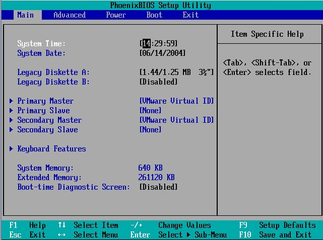

### UEFI

UEFI is the abbreviation of Unified Extensible Firmware Interface, a firmware interface for computers. It works as a “middleman” to connect a computer’s firmware to its operating system. It is used to initialize the hardware components and start the operating system stored on the hard disk drive when the computer starts up.
UEFI possesses many new features and advantages that cannot be achieved through the traditional BIOS, and it is aimed to replace the BIOS in the future altogether.
UEFI stores all the information about initialization and startup in a .efi file, a file stored on a particular partition called EFI System Partition (ESP). The ESP partition will also contain the boot loader programs for the operating system installed on the computer.
If you want to access UEFI Windows 10, you don’t need to press a key while your computer starts as computers equipped with UEFI now boot very fast, and you only have minimal time to do it. You can enter the UEFI from Windows by following these steps: 

1. Right-click the Windows **Start** menu and choose **Settings**. Then, choose **Update and Security**.

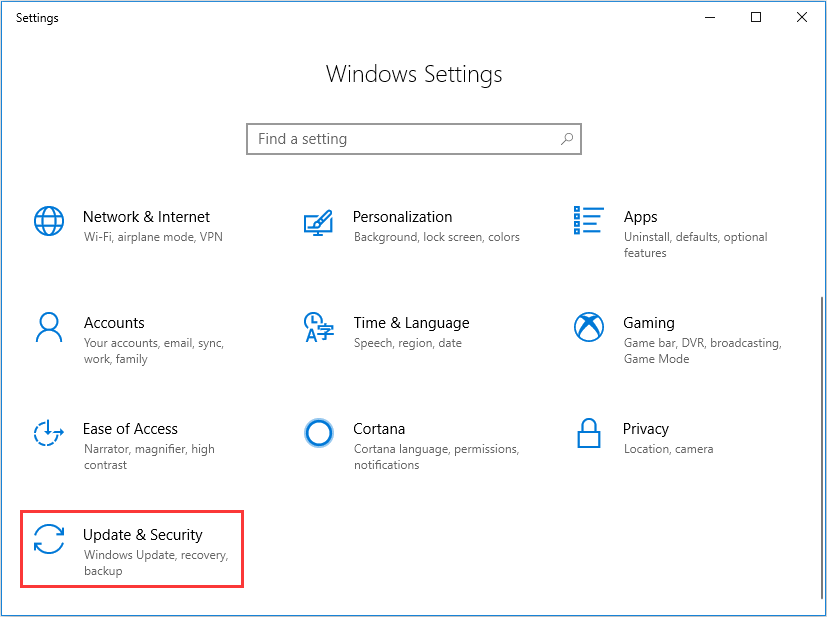

2. Select **Recovery**. At the **Advanced startup** section, **click Restart now**. Then the system will restart.

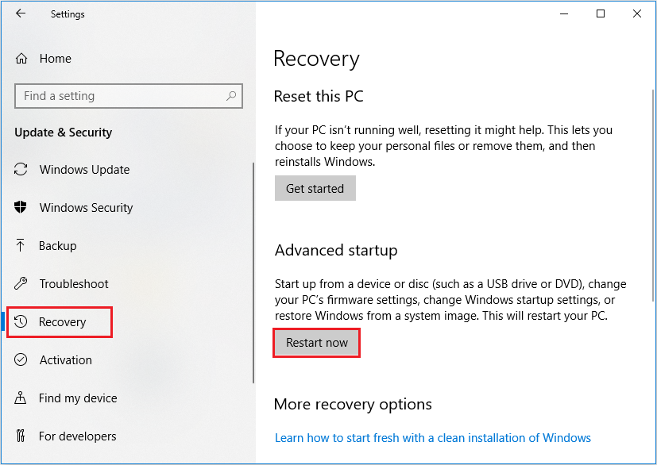

3. Click **Troubleshoot**.

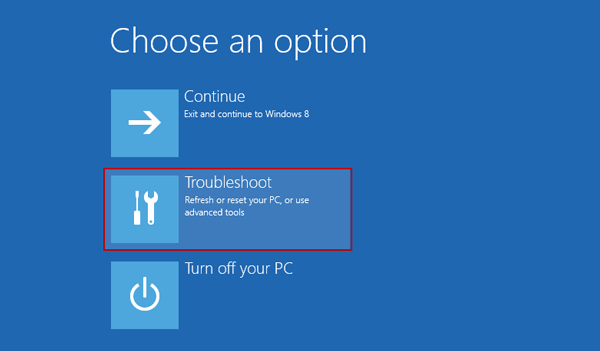

4. Choose **Advanced options**.

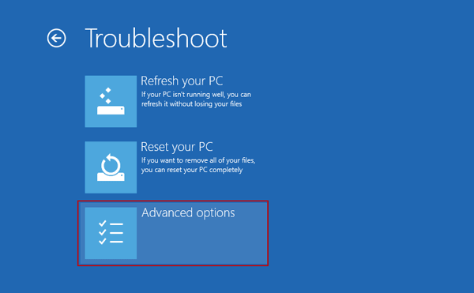

5. After that, select **UEFI Firmware Settings**.

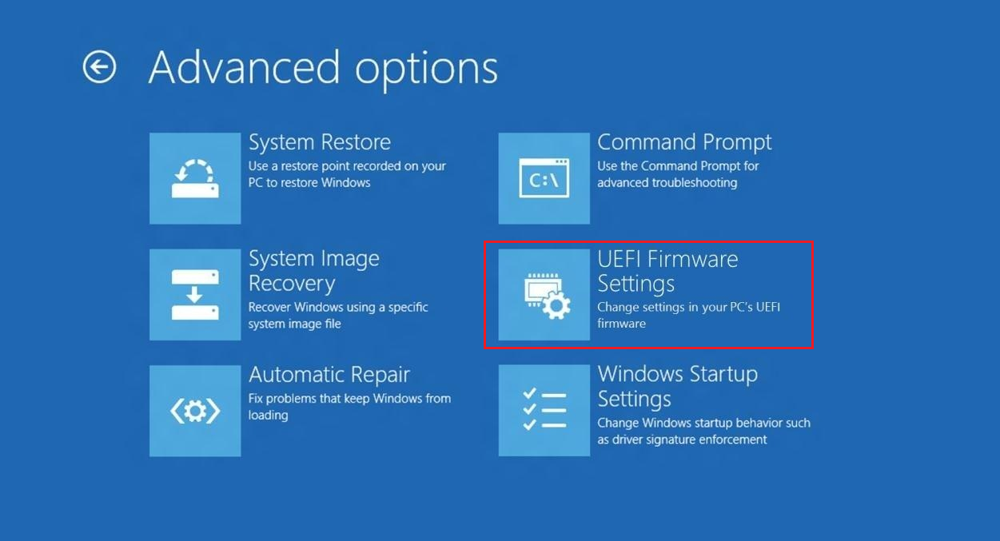

6. Click **Restart** to restart the system and enter UEFI interface.

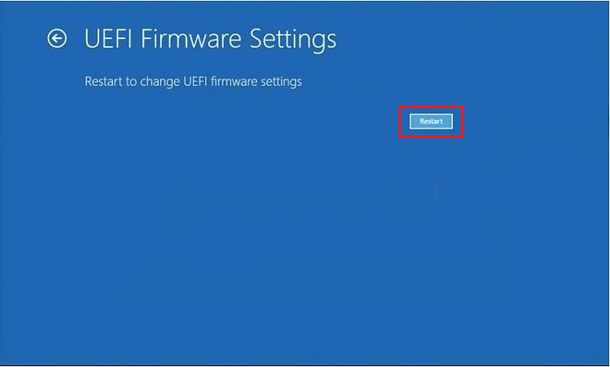

### Checking the BIOS Mode

1. Press **Windows** + **R** to bring up **Run** window.
2. Input **msinfo32** and click **OK** button to open **System Information**.
3. Click **System Summary** from the left list and go to the right pane to check the **BIOS Mode**. If it shows **Legacy**, it means you are using BIOS boot mode. For UEFI mode, it will display **UEFI** directly.

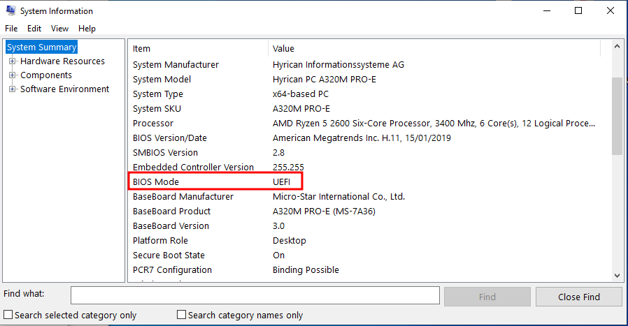

## Secure Boot and TMP

[Secure Boot](https://docs.microsoft.com/windows-hardware/design/device-experiences/oem-secure-boot) is an important security feature designed to prevent malicious software from loading when your PC starts up. The whole concept of Secure Boot requires a trust chain, from the first thing loaded by the hardware (the firmware code) to the last things loaded by the operating system as part of the kernel: the modules. In other words, not just the firmware and bootloader require signatures, the kernel and modules too. 

Most modern PCs are capable of Secure Boot, but there may be settings that cause the PC to appear not to be capable of Secure Boot in some instances. These settings can be changed in the PC firmware, often called BIOS (Basic Input/Output System), which is the software that starts up before Windows when you first turn on your PC. 

For a very in-depth explanation on Secure Boot, check out Microsoft’s [Windows Secure Boot Key Creation and Management Guidance](https://docs.microsoft.com/en-us/windows-hardware/manufacture/desktop/windows-secure-boot-key-creation-and-management-guidance?view=windows-11).

[TPM](https://docs.microsoft.com/en-us/windows/security/information-protection/tpm/trusted-platform-module-overview) is a tiny chip on your computer’s motherboard, sometimes separate from the main CPU and memory. The chip is akin to the keypad you use to disable your home security alarm every time you walk in the door or the authenticator app you use on your phone to log in to your bank account. In this scenario, turning on your computer is analogous to opening the front door of your home or entering your username and password into the login page. If you don’t key in a code within a short time, alarms will sound, or you won’t be able to access your money.

Likewise, after you press the power button on a newer PC that uses full-disk encryption and a TPM, the tiny chip will supply a unique code called a cryptographic key. If everything is normal, the drive encryption is unlocked, and your computer starts up. If there’s a problem with the key—perhaps a hacker stole your laptop and tried to tamper with the encrypted drive inside—your PC won’t boot up. 

Security features at the operating system level also already make use of TPMs. Ever used the Windows Hello face-recognition login feature on a newer laptop? That requires a TPM. 

Since 2016 [Microsoft has required](https://docs.microsoft.com/en-us/windows/security/information-protection/tpm/tpm-recommendations#tpm-20-compliance-for-windows-10) TPM 2.0 support on all new PCs that run any version of Windows 10 for desktop (Home, Pro, Enterprise, or Education). Likewise, Windows 11 will only run on PCs that have TPM capabilities. Microsoft has been strict on this requirement ahead of the Windows 11 general availability. If you download the [Windows 11 compatibility tool](https://aka.ms/GetPCHealthCheckApp) now, it will only indicate that your system is ready if TPM 2.0 is up and running.

## About Hard Drives, Partitions and Programs

### Hard Drive / Disk

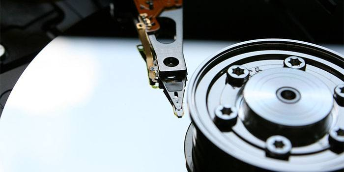

A Hard Drive is a physical device that's used to store data. It's not a standard term but a commonly-used one. While the strictest definition would be the physical device that stores data, it is often used informally to refer to any storage device, from a disk to a volume. Technically, its meaning is restricted to describing a hardware device.

It is the device that you buy in your computer store. Current typical examples for hard drives are the big, clunky Hard Disk Drives (HDD), Solid State Disks (SSD) and M.2 SSD's, also known as PCI Express NVMe SSD's.

But it is not what you are directly working on when you work on your PC. For any operating system to perform read and write data from a hard drive, the hard drive needs a filesystem.

### Partitions and Filesystems

The typical filesystem for Windows 7/8/10 is called NTFS. The (very) outdated filesystem from yesteryear is called FAT32, mostly used in Windows XP and below. A modernized version of FAT32 is called exFAT, mainly used as an optional filesystem for USB Flash Drives.

Here is the crucial part: **A hard drive can contain a partition that spans over the entire disk or contains multiple, separate partitions. It is commonly referred to as *partitioning*. To be more precise: A partition is a chunk of hard drive that contains a filesystem.**

This is, in itself, a straightforward concept to understand. However, it gets confusing in Windows because Microsoft decided to make everything user-friendly and hide this from the standard view.

When you open `Your PC` Window (from the Start Menu), Windows will show you your **partitions**, as well as all connected Flash Drives, mounted Virtual Disks as well as Floppy Disk Drives and CD/DVD/BD Drives.

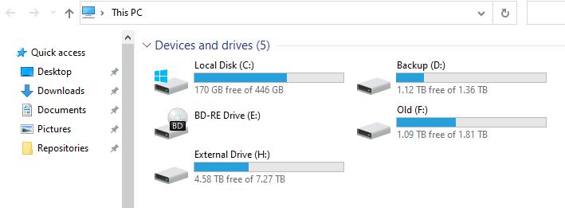

It shows the physical BD-RE Drive, but only partitions, and then calls them "Disk", which can lead to confusion and problems later, when we need to re-format the *partition* that contained the old  Operating System.

In the picture above, you can see multiple disks, and it looks like they all might be partitions that span entire Hard Disks, but it would be equally possible that "Backup" and "Old" are just two partitions on a 4TB HDD. It is impossible to tell.

To see what's going on, we need to open the Windows Disk Manager. To do this, we start with opening the Start-Menu by pressing `⊞ Win` or the Run-Menu by pressing `⊞ Win + R` and type `diskmgmt.msc` and press Enter.

Alternatively, you can open the Start-Menu and navigate to `Control Panel` > `Administrative Tools` > `Computer  Management`. Inside
`Computer Management` you can select `Disk Management` and will be greeted with a window displaying all the physical Hard Drives in the computer, as well as the partitions and their file system on them. In my example, it looks like this:

Here we can see that, yes, the partitions span the entire physical Hard Drives. Let's ignore the small partitions on the system drive, as this is
something that Windows will automatically do during the installation.

Keep your Hard Disk and partition layout in mind; you will need it later.

## Programs, Files and %APPDATA%

Let's talk about programs for a bit. If we ignore portable programs, then the standard programs (or games) come with an Installer, which typically installs many files in a directory of your choice, by default the `C:\Programs` or `C:\Programs (x86)` Folders on the Systems partition (C:). A program (or game) that comes with an installer usually includes multiple executable files, like the main program, an updater and an uninstaller.

For some programs, the configuration can be unimportant or is quickly set up. Examples are Libre Office and Microsoft Office.

However, for some programs and especially games, the configuration can either require a long time to set up or outright need keys and files that cannot easily be replaced. For example, customized User Interfaces in games, the Server list for Teamspeak- or IRC Clients, SSH private keys for Github Repositories, AES private keys for GnuPG and Mail.

And how do you save Website Passwords? Is it within the Webbrowser directly, a Browser-Plugin using encrypted Cloud Storage, or on stacks of paper notes stuffed together in the upper desk drawer?

**But where do all the programs save the configurations and essential files?**

And the answer is `%APPDATA%`, a System variable that links to `C:\Users\<Username>\AppData\`. However, you can open the Windows File Explorer (open the Start Menu with `⊞ Win` and type File Explorer) and type `%APPDATA%` and press `Enter` to enter said folder. However, when you navigate to `C:\Users\<Username>\`, the AppData folder has become invisible.

The AppData folder is hidden from the normal view to prevent normal users from accidentally deleting the folder and loose all their valuable program configurations. The File Explorer can access the option to display hidden files and folders. Inside the File Explorer, select `View` > `Options` > `Change folder and search options` and a option window will appear. Select the `View` Tab. Somewhere in the options list (depending on your current Windows version) will be the option `Show hidden files, folders and drives`.

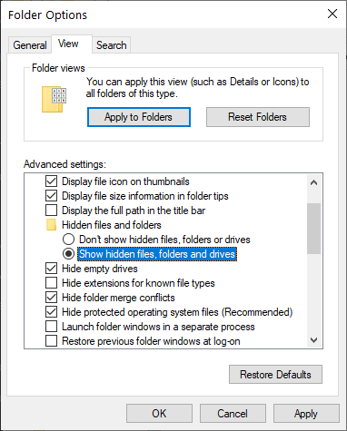

The AppData Folder will show up now.

**:warning: Since installing a new Windows will delete all the data on the partition, and programs (and games) cannot just be copied somewhere else and then copied back. They all need to be re-installed, too. However, your AppData Folder can be copied and saved, together with all other folders and files inside the `C:\Users\<Username>\` directory. It can only be selected and copied if it isn't hidden from view.**