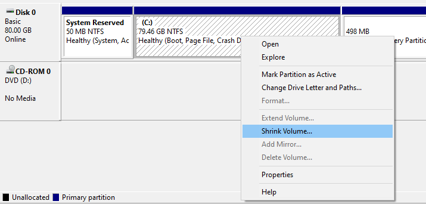

[Index](./index.md) ::[Basics](./1-preinstall-basics.md) :: **Backup** ::

* * *

# Backup of your Data

## Backup in General

You are aware that you want to re-format your Main Hard Drive partition (the one that contains a previous version of MS Windows or another Operating System) with a new File System and a fresh Installation of MS Windows 10/11. Therefore, you need to save all the old data first.

This **excludes** all installed Applications and Games, the Windows Registry and Restore Points of your current Operating System. However, your Application Settings can be saved and later restored (for most applications).

Let's open the overview of your available Hard Disk partitions under Windows by pressing the `⊞ Win` Key on your Keyboard or clicking the Symbol in your Taskbar to open the Windows Start Menu. There, select 'This PC', and a new window will show up. Here an example:

> :large_blue_diamond: **Note**
>
> If you have only one Hard Drive partition available, namely 'Local Disk (C:)', you have to be acutely aware that installing Windows 10 on this partition will wipe the File System and therefore also delete all data.

All files that need to be copied from 'Local Disk (C:)' should be contained in `C:\Users\'Username'\`. In the Explorer Window that we just opened, `double-click` on 'Local Disk (C:)', then navigate (by double-clicking) to the `C:\Users\` Folder. `Right-click` on your `C:\Users\'Username'\` Folder to open the Context-Menu, select (click) 'Properties' like so

And a new window will open, showing you the basic Properties of this Folder. Most important is the 'Size on disk' value. Here is an example from a live System

This Folder can contain everything from 2-3 GB, up to an obscene amount of data. This data needs to be saved. This means you need at least this amount of available space, somewhere **not** on 'Local Disk (C:)'. It can be one of:

- another internal Hard Disk
- an external Hard Disk / SSD
- USB-Stick or
- a Cloud-Service, such as Google Drive, Microsoft OneDrive, Dropbox, etc.
- writeable media, such as writable Blu-ray Discs (needs BD-ROM drive)

Anything is fine as long as it can hold the amount of data shown on _your_ `C:\Users\'Username'\` folder.

If there is no such option readily available, then there are two things that can still be done:

* find and clean-up space
* Split a portion of your File-System into a new, temporary partition and copy the files there. This partition will not be
touched during the installation of MS Windows 10

## Programs

Since you cannot copy your Programs to other Partitions or Drives and expect them to keep working, you can only make a list of all installed programs and prepare to re-download and re-install them. You can display all installed Programs by going to `⊞ Win > Control Panel > Programs and Features`. Having some spare time, it is a good idea to make a new Document / Text-file, list all the Programs you have installed, and a link to where you can download them again (usually by using Google and searching for the Program name). The program [Patch My PC](https://patchmypc.com/home-updater) might also help as a package manager for often-used, free or open-source software.

## Finding and making Space

If we want to find the big eaters of space hidden or forgotten inside a specific folder or partition, we need a way to visualize the size
of all subfolders in an easy to use manner. This is especially so for the  `C:\Users\'Username'\AppData` folder.

A nice, free tool to visualize which subfolders of `C:\Users\'Username'\` take up a lot of space, and might not be needed for a Backup,
is called [SpaceSniffer](http://www.uderzo.it/main_products/space_sniffer/index.html). Download it, start the application and point it
at your `C:\Users\'Username'\` folder, like so:

Let it run for a while until there are no more big changes to the picture. Let's have a look at the view of my `C:\Users\Zyrkon\` Folder:

Each square represents a folder (or subfolder) and the size of said folder. The size of each square also represents the size in relation to
all other folders. The bigger the square, the more space it needs. In my example, the folder `C:\Users\'Username'\AppData\Local\ModOrganizer`
contains 12.1 GB worth of Skyrim Mods. A game I long since uninstalled and forgotten. This is a folder that I know I can delete because I
know what it contains, and I know I do not need it any longer.

The next biggest square in SpaceSniffer is the folder `C:\Users\'Username'\AppData\Local\Spotify`. In this case, I am not so sure of the content, but I am sure that Spotify itself only needs 100 MB or 200 MB in itself. As a music streaming service, I suspect that most of the 6.8 GB of data contains temporary files from music streaming. Clicking on the Spotify-square inside SpaceSniffer will focus on the Spotify folder as the base. And certainly enough, the `Data` subfolder contains almost all the data. Using a Google search for making sure (ex.: 'Can I delete the Spotify data folder'), I find that yes, I can delete the content of the `Data` folder (but not the folder itself).

The general rule for cleaning up your filesystem in this way is to delete folders or files when you are confident that you can do so. If you do not know what the files do, you should not delete them.

### Three easy ways to make space

1. Open the Recycle Bin on your Desktop, check the content to make sure all files can be irrevocably deleted, and click the `Empty Recycle Bin`- Button.

2. From the `This PC`-Window we can right-click on `Local Drive (C:)` and open the `Properties-Window, like so:

Here we can click on `Disk Clean-up`. Windows will collect all data that we can safely delete:

3. In your preferred Web-Browser, open the Options or Settings. Depending on your browser, there will be a button to clear your Browser-Data. In Google Chrome, we can find this under Settings (3 dots) > More Tools > Clear browsing data. Select the time range 'All time' and deselect 'Cookies'.

In Firefox we can find this under Options > Privacy & Security > Clear Data... as shown below:

Deselect Cookies and delete the rest:

### Compressing Pictures

With Smartphones, it has become common to take lots and lots of pictures. Eventually, these pictures get transferred to the Computer to make room on the Smartphone. In the best case, the images get sorted by year and event with a proper file structure, or in the worst case get dumped into one big folder. The Pictures can take up a massive amount of disk space. Initially, it is good to have the pictures in a very high resolution because it will produce better results for editing or printing. However, when archiving images just for looking at them later, we can radically reduce the picture size, and therefore the file size.

An easy way to do so is by using the free tool [Mass Image Compressor](https://sourceforge.net/projects/icompress/). After downloading and installing the tool, we can point it at any folder structure and select the quality and maximum image size for each picture. My recommendation is to use a picture quality of 80% and a fixed image width of 1920 (pixel):

When compressing multiple folders (and subfolders) of pictures all at once, the program will **replace** the new image files with new ones. The other option is to go folder by folder and let the program create a new subfolder with all the newly generated images inside.

### Compressing Videoclips

What can be said about images can be said about videos, too. There are some free tools available online, together with instructions on youtube on how to use them. Two such tools are the [Freemake Video Converter](https://www.freemake.com/) and the [HandBrake Video Transcoder](https://handbrake.fr/). Keep in mind that converting large video files will take a long time, depending on your CPU. Another way to effortlessly convert videos is to upload them to youtube as private, unpublished videos. Youtube will run all its video quality enhancement- and video compression algorithms over the footage, and we can finally download the new video file back from youtube. To do so will require a free account on youtube as well as a fast internet connection.

## Splitting a Partition

> :warning: **Warning**
>
> The following part should only be used as a last resort to store files temporarily if no other means are available (external Hard Drive, etc).

Most pre-built and OEM Computers that come with Windows pre-installed usually only have one Hard Drive installed and have one partition that spans the entire Hard Drive. If we want to save our data and do not have any other options available to keep the data on external Hard Drives, Thumb Drives or into the Cloud, we can still make do with some tricks. Since the files are on the partition `Local Disk (C:)`, we can split available space from this partition and make a new partition out of it.

Albeit there are some limitations we have to be aware of doing so:

- there needs to be enough free space available that we can split away
- We can only take a maximum of 50% of the maximum size of the partition
- there should still be 10% of free space available on the partition after splitting

### Example 1

All the files we want to save are inside the `C:\Users\MyName` folder. The folder is 600 GB large and contains many images and
video files. We already used all the suggestions from [Making Space](../making-space/) to free up some space. The partition has a size of 1 TB (1024 GB), and all together, 850 GB are in use (our files, installed programs, MS Windows).

Since we are about to install Windows 10 and delete the entire partition in the process, we might uninstall some of the more extensive programs
via `⊞ Win > Control Panel > Programs and Features`. Before uninstalling a program, we might want to write it down on a list, see [Pre-Install Backup](../pre-install-backup/). We gain 60 GB of extra free space in this example for 234 GB.

We do not have the required free space for a full copy of the `C:\Users\MyName` folder. The best we could do is:

- total partition space: 1024 GB
- current used space: 790 GB (77%), free space 234 GB (23%)
- space we can use to split: ~ 150 GB,

because the new total volume size will then be 874 GB, which means 790 GB will then take 90% of available space, leaving 10% free. So, at best, we can get away with 150 GB. My recommendation for this example would be to buy an external Hard Disk with 2TB (or more).

### Example 2

The entire partition spanning over the Hard Drive is 1 TB again, but this time the files in `C:\Users\MyName` only use 45 GB. We have already cleaned up all unnecessary data and uninstalled most programs. The total space used is 300 GB.

- total partition space: 1024 GB
- current used space: 300 GB (30%), free space: ~700 GB (70%)
- we have more than 50% of the total space available and could split up to 512 GB

However, we only need 45 GB. We add a 10% safety margin and split 50GB from `Local Disk (C:)`.

### Using the MS Windows Disk Management

To open the `Disk Management Tool`, we need first to open the `Computer Management` tool. To do so, we press the `⊞ Win` - key and type `Computer Management` into the Task Bar Search. Alternatively, we can navigate to `⊞ Win > Windows Administrative Tools > Computer Management`. On the left inside the `Computer Management`, we click on `Disk Management` and will see an overview of all available Hard Drives and their partitioning:

We can ignore the small extra partitions on the Hard Drive, as MS Windows needs them to function correctly. In this example, we want to split 10 GB from the primary partition. To do so, we right-click on the primary partition and select `Shrink Volume...`

Now we enter the amount we want to split: 10 * 1024 MB = 10240 MB = 10 GB

Our actions result in 10 GB of unallocated space, meaning there is no partition on it yet, and can't be used. We can quickly fix this by right-clicking on the now unallocated space and select `New Simple Volume...`

A `New Volume Wizard` will pop up, where we could select multiple options to create the new volume. However, no pre-selected option needs any change, so we can just hit `Next` on each page (We want to allocate the entire available space, assign a drive letter to it and format the new partition with NTFS). The resulting confirmation screen should look like this, apart from the size and possibly the drive letter:

We confirm our selection and click on `Finish`. The new partition will be created and will show up as a new "drive" in our `This PC` Window:

We can now create folders and copy and paste (or move) data to this new partition. All the files on this partition will be safe during the installation of Windows 10.

## Merging Partitions together

After said installation and the re-formatting of the primary partition, and **after** we copied all the data back, we can reverse the process again. We need to go back into the `Disk Management Tool`, delete the volume and merge the unallocated space back. Be careful to select the correct partition to delete:

> :warning: **Important**
>     The process of deleting the NTFS partition is irreversible and will delete all data from the selected volume.

**Note:** We want to extend the primary partition with the unallocated space. Therefore we need to right-click on the partition labelled `(C:)`.

